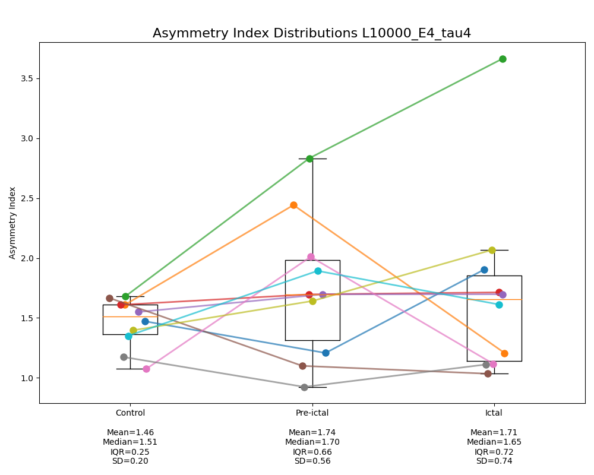
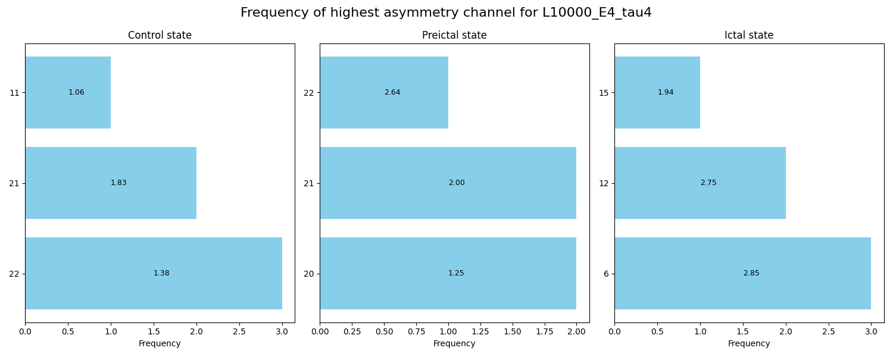

# Epileptic Seizure Analysis: Asymmetries in Causality using Convergent Cross Mapping
_Degree Project in Computer Science and Engineering, First cycle, 15 credits_  
Code developed by Tenzin Sangpo Choedon, Spring 2025

## 📄 Abstract
Exploring brain connectivity is essential to gain a deeper understanding of epileptic seizure dynamics. Particularly, effective connectivity is used for detecting causal relationships between neural regions, with Granger Causality (GC) being a widely recognized measurement. However, identifying the specific EEG channels that are causally involved in epilepsy remains a challenge. Convergent Cross Mapping (CCM) has been developed to address these limitations of GC. Despite the potential of CCM, there have been minimal real applications in epilepsy. Additionally, previous research suggests that there is a stronger directional causal influence on certain brain regions during seizures. Therefore, this study explores causal asymmetries across channels in epilepsy by applying CCM to EEG data. The methodology of this study involves  preprocessing the data from the CHB-MIT dataset, passing it into the CCM algorithm, tuning the CCM parameters, and evaluating the resulting causality across non-seizure, preictal and ictal states through asymmetry measures. The results indicate that causality patterns are generally more asymmetric during pre-seizure and seizure activity compared to non-seizure activity. Furthermore, results from individual channels suggest that channels 20 and 21, as well as channels 6 and 12 most consistently exhibit the highest asymmetry in causality for pre-seizure and seizure activity, respectively, which is partially consistent with previous findings. It is concluded that CCM can be applied, with the improvements of scalable methods, to identify potential EEG channels that are important for underlying directional connectivity involved in seizure dynamics.

## 🗂️ Table of Contents

- [Abstract](#-abstract)
- [Project Structure](#-project-structure)
- [Prerequisites](#-prerequisites)
- [Usage](#-usage)
- [Key Findings](#-key-findings)

## 🏗️ Project Structure

root/  
├── src/  # Python scripts for preprocessing, computing and evaluating ccm scores  
├── docs/  # Documentations such as the thesis report and select few generated illustrations  
├── data/  # CHB-MIT dataset is loaded and stored here  
├── README.md  
└── .gitignore  

## ✅ Prerequisites

**Python 3.7+**  
- Required Python packages (install via pip):  
  ```bash
  pip install numpy scipy pandas matplotlib pyEDM
  ```
**CCM**  
- Download Python juypiter version from [here](https://phdinds-aim.github.io/time_series_handbook/06_ConvergentCrossMappingandSugiharaCausality/ccm_sugihara.html#introduction)

**CHB-MIT**
- Download dataset from [here](https://physionet.org/content/chbmit/1.0.0/#files-panel) and store it in root/data folder 


## 🚀 Usage

Run the scripts in this order:

1. **Preprocess data**  
   ```bash
   python src/preprocess_data.py
   ```
2. **Compute CCM on subjects**  
   ```bash
   python src/process_CCM_subjects.py
   ```
3. **Evaluate CCM results of all subjects**  
   ```bash
   python src/eval_CCM_subjects.py
   ```

## 📘 Key Findings
[More details in the Thesis](docs/Thesis.pdf)
<p align="center">
  
</p>

<p align="center">
  
</p>
